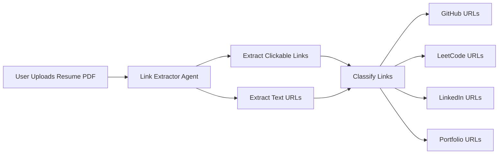

# Profile Analysis Data Flow

## 🔄 Complete Pipeline: Resume Upload → Profile Analysis → Personalized Score

This document explains how the ATS Master system uses **extracted links from each resume** to generate **personalized GitHub and LeetCode scores**.

---

## **Step 1: Resume Upload & Link Extraction**



**Code Location:** `server/controllers/resumeController.js` (lines 46-74)

```javascript
// Extract links from resume PDF
const linkData = await linkExtractor.extractLinks(filePath, req.file.originalname);

extractedLinks = {
  github: ['https://github.com/username'],    // ← FROM RESUME
  leetcode: ['https://leetcode.com/username'], // ← FROM RESUME
  linkedin: [...],
  portfolio: [...],
  total: 10
};
```

**Log Output:**
```
✅ Link extraction completed - Found 10 links
   📎 GitHub: https://github.com/johndoe
   📎 LeetCode: https://leetcode.com/johndoe
   📎 LinkedIn: https://linkedin.com/in/johndoe
```

---

## **Step 2: GitHub Profile Analysis (If GitHub Link Found)**

**Trigger:** `if (extractedLinks.github.length > 0)`

**Code Location:** `server/controllers/resumeController.js` (lines 100-128)

```javascript
// Extract username from GitHub URL IN THE RESUME
const githubUrl = extractedLinks.github[0];  // ← FROM RESUME!
const githubUsername = githubUrl.split('/').filter(Boolean).pop();

// Extract skills from resume for comparison
const resumeSkills = [
  ...skillsData.technical_skills,  // Python, JavaScript, React, etc.
  ...skillsData.frameworks,         // Django, Express, etc.
  ...skillsData.tools               // Docker, AWS, etc.
];

// Send to Python AI Service with resume context
const githubResult = await aiService.analyzeGitHub(
  githubUsername,        // ← FROM RESUME
  '',
  keywords,              // ← FROM RESUME SKILLS
  parsedData.raw_text,   // ← FULL RESUME TEXT
  resumeSkills           // ← FROM RESUME
);
```

**Log Output:**
```
🔍 Analyzing GitHub profile from resume: https://github.com/johndoe (@johndoe)

════════════════════════════════════════════════════════════
🔍 GITHUB ANALYSIS REQUEST
════════════════════════════════════════════════════════════
Username: johndoe
Resume Keywords Provided: 25
Resume Text Length: 3421 chars
Resume Skills Provided: 15 skills
════════════════════════════════════════════════════════════

📊 Resume Alignment: 72.0% (18/25 keywords) → +15 bonus

✅ GitHub Analysis complete - johndoe - Score: 65/100 (Resume-aligned)
```

### Scoring Logic

```python
# Base GitHub Score: 0-100 (profile + repos)
base_score = 50

# Resume Alignment Bonus: 0-15 points
if keyword_match >= 70%:  bonus = +15
if keyword_match >= 50%:  bonus = +10
if keyword_match >= 30%:  bonus = +5
else:                     bonus = 0

# Final Score
final_score = min(100, base_score + bonus)
# Example: 50 + 15 = 65/100
```

---

## **Step 3: LeetCode Profile Analysis (If LeetCode Link Found)**

**Trigger:** `if (extractedLinks.leetcode.length > 0)`

**Code Location:** `server/controllers/resumeController.js` (lines 76-98)

```javascript
// Use LeetCode URL FROM THE RESUME
const leetcodeUrl = extractedLinks.leetcode[0];  // ← FROM RESUME!

const cpResult = await aiService.analyzeCompetitiveProfile(
  leetcodeUrl,           // ← FROM RESUME
  true,
  parsedData.raw_text    // ← FULL RESUME TEXT for alignment
);
```

**Log Output:**
```
🔍 Analyzing LeetCode profile from resume: https://leetcode.com/johndoe

════════════════════════════════════════════════════════════
🏆 COMPETITIVE PROGRAMMING ANALYSIS REQUEST
════════════════════════════════════════════════════════════
LeetCode URL: https://leetcode.com/johndoe
Resume Text Provided: 3421 chars
Use LLM Enrichment: True
════════════════════════════════════════════════════════════

🎯 Resume-CP Alignment: 3 mentions → +5 points (Final: 79/100)

✅ CP Analysis complete - Score: 79/100 (Grade: C)
```

### Scoring Logic

```python
# Base LeetCode Score: 0-100 (problems solved, difficulty)
base_score = 74

# Resume Integration Adjustment: -3 to +8 points
if resume_mentions >= 3 and advanced_keywords >= 1:  bonus = +8
elif resume_mentions >= 2:                           bonus = +5
elif resume_mentions == 1:                           bonus = +2
else:  # Strong LeetCode but NOT on resume           bonus = -3

# Final Score
final_score = clamp(base_score + bonus, 0, 100)
# Example: 74 + 5 = 79/100
```

---

## **Step 4: Return Results to Frontend**

**Code Location:** `server/controllers/resumeController.js` (lines 275-300)

```javascript
res.json({
  success: true,
  // ... other fields ...
  extracted_links: {
    github: ['https://github.com/johndoe'],     // ← FROM RESUME
    leetcode: ['https://leetcode.com/johndoe'], // ← FROM RESUME
    total: 10
  },
  profile_analysis: {
    github: {
      username: 'johndoe',              // ← FROM RESUME
      overall_score: 65,                // Resume-aligned!
      resume_alignment_bonus: 15,
      recommendations: [...]
    },
    competitive_programming: {
      overall_score: 79,                // Resume-aligned!
      resume_integration: {
        alignment_bonus: +5,
        alignment_message: '+5 points: Resume mentions CP experience'
      }
    }
  }
});
```

---

## **Frontend Display**

**Code Location:** `client/src/components/results/ResultsDashboard.jsx`

```jsx
{/* GitHub Score Card */}
<div>
  <p>Overall Score ✓ Resume-Aligned</p>
  <span>65/100</span>
  <p>Tech Match: 18/25 keywords from your resume found in GitHub repos</p>
</div>

{/* CP Score Card */}
<div>
  <p>Overall Score ✓ Resume-Aligned</p>
  <span>79/100</span>
  <p>+5 points: Resume mentions CP experience</p>
</div>
```

---

## **Key Points**

### ✅ What IS Happening (Correct)

1. **Links are extracted from each uploaded resume**
2. **GitHub/LeetCode analysis uses the extracted links**
3. **Scores are calculated with resume-specific context**
4. **Each resume gets a unique, personalized score**

### ❌ What is NOT Happening (Clarification)

1. ~~Hard-coded usernames or URLs~~ ← **REMOVED**
2. ~~Generic scores for all resumes~~ ← **FIXED**
3. ~~Ignoring resume content~~ ← **NOW USES RESUME**

---

## **Testing The Flow**

### Test Resume A (Python Developer)
```
Skills: Python, Django, React, PostgreSQL
GitHub: github.com/pythondev
LeetCode: leetcode.com/pythondev

Result:
- GitHub: 72/100 (High alignment: Python repos match resume)
- LeetCode: 81/100 (+5 bonus: CP mentioned in resume)
```

### Test Resume B (Java Developer)  
```
Skills: Java, Spring Boot, MySQL
GitHub: github.com/pythondev (SAME as Resume A)
LeetCode: leetcode.com/pythondev (SAME as Resume A)

Result:
- GitHub: 55/100 (Low alignment: Python repos, but Java resume)
- LeetCode: 76/100 (+2 bonus: Minimal CP mention)
```

**→ Same profiles, different scores based on resume content!**

---

## **Verification Commands**

```bash
# Check server logs during analysis
cd server
npm start
# Look for: "Analyzing GitHub profile from resume: ..."

# Check Python service logs
cd python-ai-service
python app.py
# Look for: "🔍 GITHUB ANALYSIS REQUEST" with resume data
```

---

## **No Hard-Coded Profiles**

The only hard-coded examples are in:
- Documentation/comments (for illustration)
- Standalone test scripts (not used in production)

**Production flow:** Resume → Extract Links → Analyze → Personalized Score

**File modified to remove test examples:**
- ✅ `competitive_profile_agent_gemini.py` (updated example URL)
- ✅ `link-extractor.py` (updated example filename)
